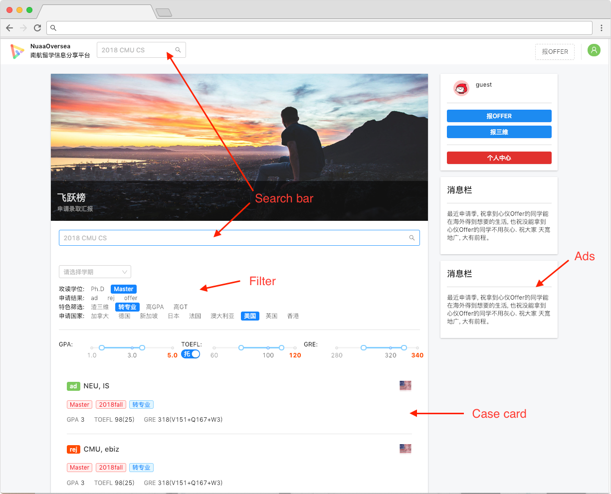
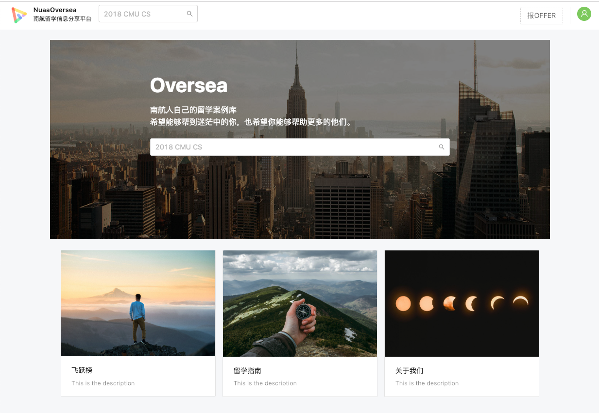
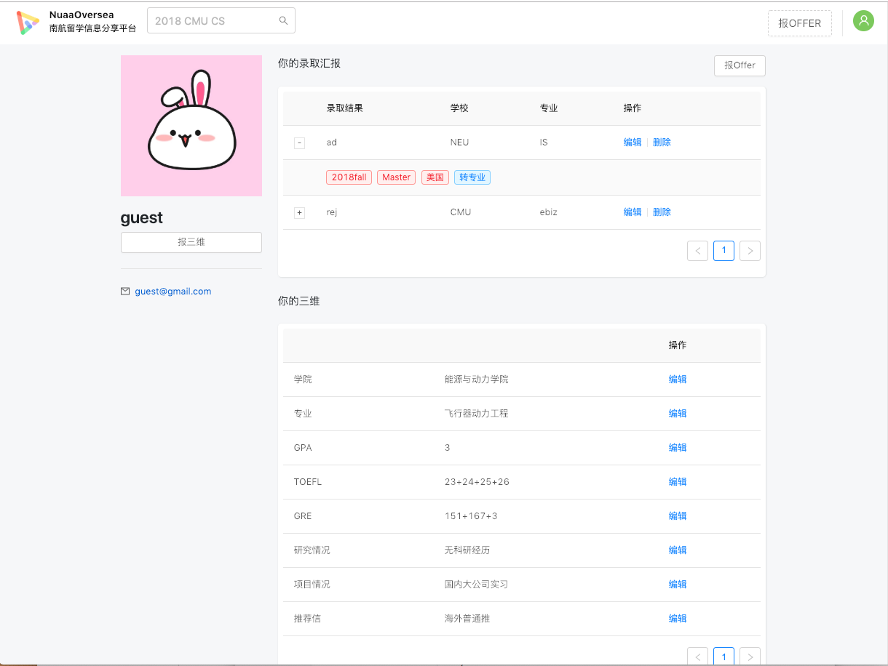
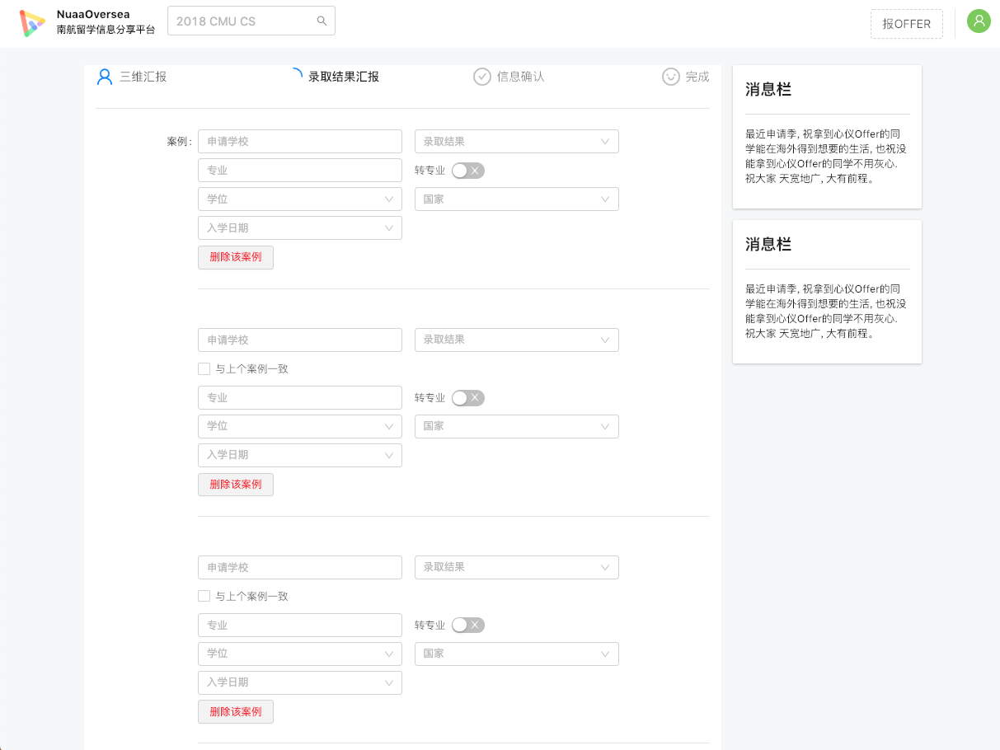

# NuaaOversea-frontend-React


NuaaOversea is a studying aboard information sharing platform, which collects information about the admission of students from [NUAA](http://iao.nuaa.edu.cn/) and students' GPA, Language score(TOEFL, IELTS), GRE, etc. 

Provide students with data and similar cases for reference and help them make more informed decisions.

Created with React and ❤️

This repository stores the code for **frontend**. You can visit the backend code [here](https://github.com/LiXuanqi/NuaaOversea-backend-Flask)



|      Home         |  Profile | Form |
| :-------------:| :-----:| :-----: |
|  |  | 

## Getting Started

These instructions will get you a copy of the project up and running on your local machine for development and testing purposes. See deployment for notes on how to deploy the project on a live system.

### Prerequisites

- node.js

### Development

A step by step series of examples that tell you how to get a development env running
#### Config proxy
If your APIs are deployed at `http://my.backend.com/oversea/api`, you should config in `.webpackrc.js` like this.
```json
    "/oversea/api":{
        "target": "http:my.backend.com/",
        "changeOrigin": true,
    }
```
#### Run dev server
```shell
$ git clone https://github.com/LiXuanqi/NuaaOversea-frontend-React.git
$ npm install
$ npm start
```
Open your browser, visit **[http://localhost:8000/](http://localhost:8000/)**

## Deployment
### Config fallback Url
Deploy it as a static website. It's a SPA(Single-page application), so you should config fallback url. There is an example of *Nginx*
```
    location /oversea {
        alias /Users/lixuanqi/GitHub/NuaaOversea-frontend-React/dist;
	    try_files $uri $uri/ /oversea/index.html;
    }
```
### Build
```shell
$ npm run build
```

If your base url is not `/`, For example, you want to deploy your website at `http://your.website.com/oversea`

```shell
$ BASE_URL=/oversea umi build
``` 

For more instructions, click [here](https://umijs.org/guide/deploy.html#default-scheme)

## Built With


- [React](https://reactjs.org/)
- [React Router](https://reacttraining.com/react-router/web/guides/philosophy)
- [Redux](https://redux.js.org/)
- [Ant Design](https://ant.design/index-cn)
- [Umi](https://umijs.org/)

## Authors

* **Xuanqi Li** - *Initial work*

See also the list of [contributors](https://github.com/LiXuanqi/NuaaOversea-frontend-React/graphs/contributors) who participated in this project.

## License

This project is licensed under the MIT License - see the [LICENSE.md](LICENSE.md) file for details
